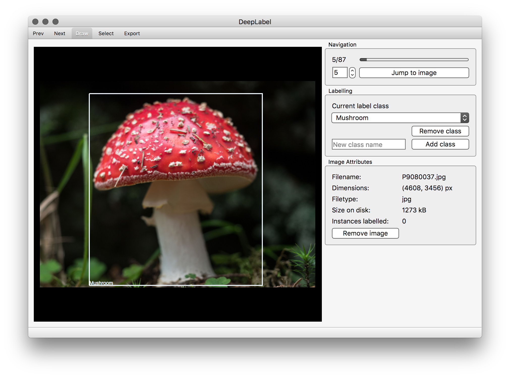

# DeepLabel

**Note: while this tool is functional for simple image labelling, it is under active development and things like GUI layout and functionality are likely to change!**

DeepLabel is a cross-platform tool for annotating images with labelled bounding boxes. A typical use-case for the program is labelling ground truth data for object-detection machine learning applications.

DeepLabel was built with convenience in mind. Image locations, classes and labels are stored in a local sqlite database (called a _project_, in the application). When a label is added or removed, this is immediately reflected in the database.

A typical workflow for DeepLabel is:

1. Create a new project database
2. Add a folder of images, or manually select images to add
3. Load in a class list, or manually add classes
4. Label the images
5. Export data in the desired format (e.g. KITTI, Pascal VOC)

Currently only KITTI format is supported, but this should change shortly.

Installation
--

Clone the repo, open the pro file in Qt Creator and build. Deployment is automatic on Windows and OS X.

It's recommended that you use Qt5, but Qt4 will probably work. You need to have Qt's SQL extensions installed.

This is mostly a pure Qt project, but there are some limitations to what Qt can do with images. In particular, scaling sucks (even with `Qt::SmoothTransform`). Qt's image reader is also not particularly robust, so OpenCV is used there. OpenCV is also used for image augmentation. On OS X it's expected that you have `pkg-config` installed to handle dependencies.

`madeployqt` is automatically run after compilation, and on OS X will build a `.dmg` file. This does have the irritating side effect of linking and copying every `dylib` OpenCV has to offer so feel free to dig into the package and delete some of the dylibs that you don't need. This is a tradeoff between output file size and convenience. The main dependencies are `opencv_core`, `opencv_imgcodecs`, and `opencv_imgproc`. Unfortunately `core` and `imgproc` are by far the largest library files...

Usage
--

Using the software should be fairly straightforward. Once you've created a project database and added images to it, you can get on with the fun part of adding bounding boxes.

DeepLabel operates in two modes: draw and select. In **draw** mode, you can click to define the corners of a bounding box rectangle. If you're happy with the box, hit space to confirm. The rectangle will be added to the image with a class label.

If you need to delete a label, switch to **select** mode. Click on a rectangle, it will highlight green, the hit delete or backspace to remove it.

All changes are immediately relected in the database.

Navigate through images using the left/right or a/d keys. You should find a/d to be quite a natural way of navigating without moving your left hand. There is a progress bar to indicate how far through the dataset you've labelled.

Once you're done labelling, open the export menu to copy and rename your images and generate label files.

Notes
--

#### Overlapping bounding boxes

DeepLabel doesn't care if your bounding boxes overlap, but selecting overlapping bounding boxes is a tricky problem from a UI point of view. Currently the solution is simple: all rectangles containing the cursor will be highlighted and if you hit delete, the most recent one will be deleted.

#### Image paths

Image paths in the database are stored relative to the database location. This means you can easily copy over files to another system, provided you keep the relative structure of the files.

#### Support for other descriptors (e.g. occluded, truncated)

In the future I'd like to add the ability to mark labels as occluded or truncated. I haven't decided on the best way to implement this yet - most detector networks don't use this information, but it's useful for stats.

#### Database schema

DeepLabel uses a simple relational database with the following schema:

	CREATE TABLE classes (class_id INTEGER PRIMARY KEY ASC, name varchar(32))
	CREATE TABLE images (image_id INTEGER PRIMARY KEY ASC, path varchar(256))
	CREATE TABLE labels (label_id INTEGER PRIMARY KEY ASC, image_id int, class_id int, x int, y int, width int, height int)
	
These fields are the bare minimum and more may be added later (see note on descriptors above). It may also be useful to include metadata about images for statistics purposes.

#### Export format

Currently KITTI formatting is provided in-software. I hope to add others e.g. VOC or yolo in the future.

Since the labelling metadata is in the sqlite database, it should be fairly easy to write a Python script (or whatever) to convert the output to your preferred system.

#### License

This code is MIT licensed - feel free to fork and use without restriction, commercially or privately, but please do cite. Copyright Josh Veitch-Michaelis 2017.
